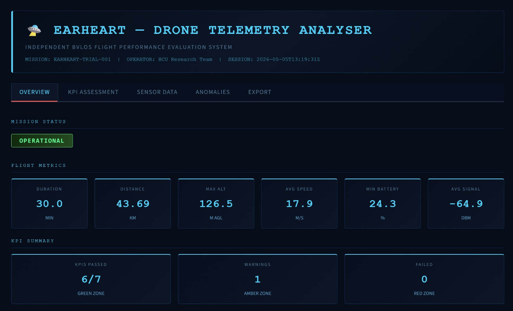

# 🛸 Drone Telemetry Analyser

**Independent evaluation system for UAV BVLOS flight performance — aligned with the EU-funded [EARHEART project](https://earheart-project.eu) on cloud-based autonomous drone operations.**



---

## What It Does

This tool provides structured, evidence-based evaluation of BVLOS drone flight telemetry data against EASA SORA operational KPIs. It mirrors the independent evaluation responsibilities of BCU on the EARHEART project — assessing AI-enabled drone platforms, evaluating sensor performance against defined trial KPIs, and producing structured outputs for regulatory and consortium reporting.

**Core capabilities:**

- Real-time KPI evaluation against 7 EASA SORA operational standards
- Automated anomaly detection and event logging
- Sensor performance visualisation (GPS, C2 link, battery, altitude, speed, wind)
- Interactive dark-theme mission control dashboard
- Structured JSON report export for consortium and regulatory submission
- Live flight path mapping with altitude colour coding

---

## KPIs Evaluated

| KPI | Threshold | Regulatory Basis |
|---|---|---|
| GPS Positioning Accuracy | HDOP < 2.0 | EASA AMC RPAS.1309 |
| GPS Satellite Coverage | Min 6 satellites | UK CAA CAP 722 |
| C2 Link Signal Strength | > -75 dBm | EASA SORA OSO #10 |
| Battery Reserve Margin | Never below 20% | EASA UAS.SPEC.050 |
| Altitude Holding Accuracy | Deviation < 5m | EASA SORA OSO #06 |
| Speed Limit Compliance | Max 25 m/s | EASA ConOps Envelope |
| Wind Envelope Compliance | Max 10 m/s | Manufacturer limits |

---

## Tech Stack

- **App:** Streamlit (dark mission control theme)
- **Visualisation:** Plotly (interactive charts + radar)
- **Data:** Pandas, NumPy
- **Risk Engine:** Custom SORA-aligned KPI scoring
- **Language:** Python 3.10+

---

## Quickstart

### 1. Clone the repo
```bash
git clone https://github.com/Lakshan-D/drone-telemetry-analyser.git
cd drone-telemetry-analyser
```

### 2. Create virtual environment
```bash
python -m venv venv
venv\Scripts\activate   # Windows
source venv/bin/activate  # Mac/Linux
```

### 3. Install dependencies
```bash
pip install -r requirements.txt
```

### 4. Generate sample flight data
```bash
python generate_sample_data.py
```
Creates three sample flight logs in `data/sample_logs/` — one nominal flight and one with injected anomalies for demonstration.

### 5. Run the app
```bash
streamlit run app.py
```

Opens at `http://localhost:8501`

---

## Project Structure

```
drone-telemetry-analyser/
├── app.py                      # Main Streamlit application
├── generate_sample_data.py     # Sample telemetry generator
├── requirements.txt
├── utils/
│   └── kpi_engine.py           # SORA-aligned KPI evaluation engine
└── data/
    └── sample_logs/            # Generated flight telemetry CSVs
```

---

## Expected CSV Format

```
timestamp, latitude, longitude, altitude_m, speed_ms, battery_pct,
gps_satellites, hdop, signal_dbm, pitch_deg, roll_deg, yaw_deg,
wind_speed_ms, temperature_c
```

Compatible with DJI, ArduPilot, and PX4 log exports (with column renaming).

---

## Relevance to EARHEART Project

The [EARHEART](https://earheart-project.eu) EU project trials cloud-based BVLOS drone operations and produces regulatory outputs including a BVLOS White Paper. BCU's role is independent evaluation of trial platforms. This tool demonstrates the core evaluation methodology:

```
Flight telemetry → KPI assessment → Anomaly detection → Regulatory report → Policy recommendation
```

---

## Author

**Lakshan Divakar**
MSc Electronics & Electrical Engineering, Brunel University London
Research Lab Assistant — LiDAR, Drones, AGV, Sensor Fusion

[GitHub](https://github.com/Lakshan-D) | [LinkedIn](https://linkedin.com/in/lakshan-d) | [Email](mailto:lakshan.d.2108@gmail.com)

---

## License

MIT License — free to use, modify, and share with attribution.
